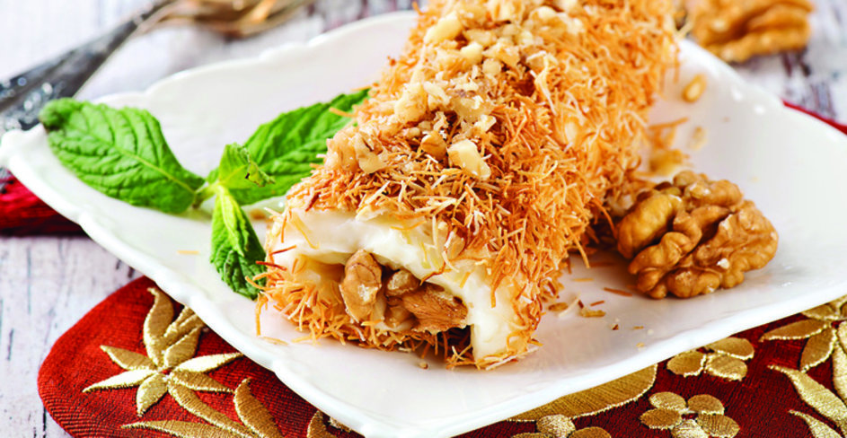

         <h1><em>...KADAYIFLI PAŞA SARMASI...</em></h1>
        

  __Kaç Kişilik:6 Kişilik__

---

İftardan sonra sindirimi kolaylaştırması için genellikle hafif sütlü tatlılar tercih edilir. Kolay sindirimiyle, ağzınızı tatlandıracak Kadayıflı Paşa Sarması tarifi.

**_MALZEMELER_**

  * 300 gram hazır muhallebilik kadayıf

  * 1 litre süt

  * 3 çay bardağı toz şeker

  * 3 çay bardağı un

  * 2 paket vanilya

  * 200 gram tereyağı

**_İÇ MALZEME İÇİN_**

  * 250 gram iri çekilmiş ceviz

  * 1 çay kaşığı tarçın

  ---

 **_KADAYIFLI PAŞA SARMASI NASIL YAPILIR?_**

Sütü bir tencereye alıp üzerine toz şeker ve un ekleyip topak kalmayana dek

iyice karıştırın.Ocağa oturtup koyulaşana kadar pişirin ve ocaktan alın. Üzerine

vanilya ve tereyağını ilave edip mikser yardımıyla 15 dakika çırpın. Büyük boy

fırın tepsisinin içine kadayıfı yayın.Kıvamı yumuşayan muhallebiyi ıslatılmış

kaşık yardımıyla kadayıfın üzerine yayın. 3 saat buzdolabında bekletin.Daha

sonra 12x12 cm'lik kareler halinde dilimleyin. Ortalarına ceviz koyup tarçın

serpin. Rulo şeklinde sarıp servis yapın.

**_AFİYET OLSUN._**

Tarif:Şefika Günyel

---

**ETİKETLER**
[KADAYIFLI PAŞA SARMASI](https://www.sofra.com.tr/tarifler/sutlu-tatlilar/kadayifli-pasa-sarmasi)
    
